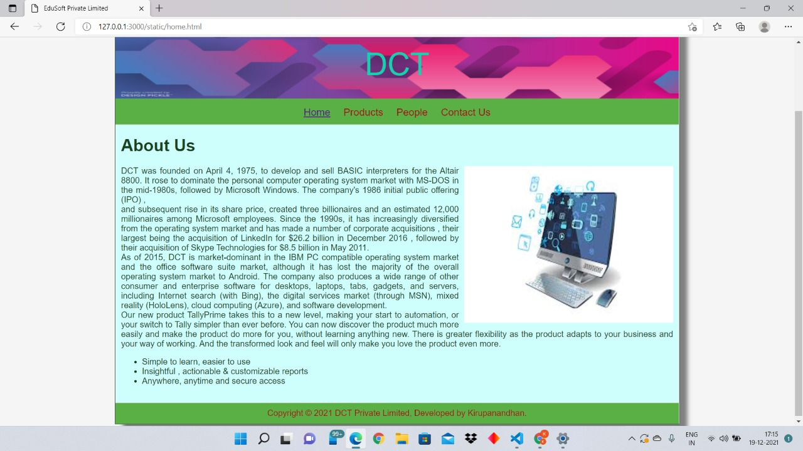
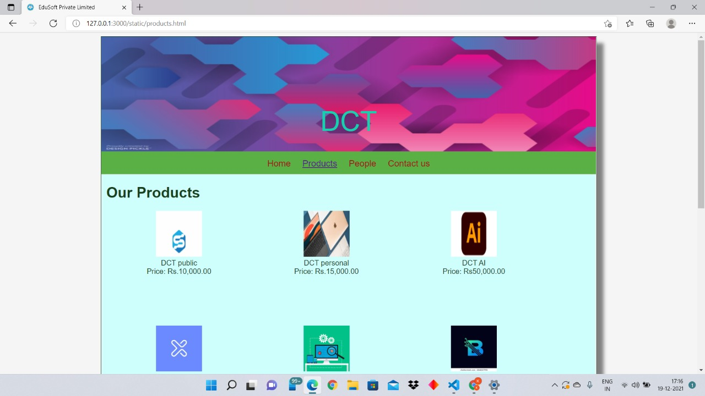
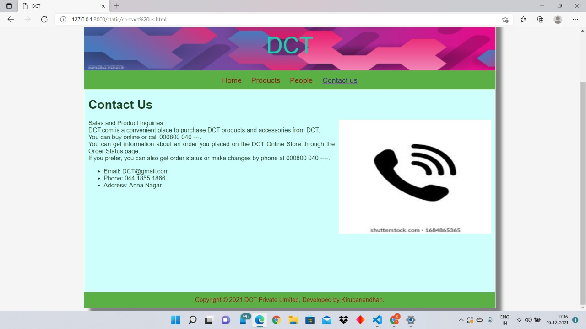

# Web Design for a Software Product Company

## AIM:

To design a static website for a software product company company.

## DESIGN STEPS:

### Step 1:

Requirement collection.

### Step 2:

Creating the layout using HTML and CSS.

### Step 3:

Updating the sample content.

### Step 4:

Choose the appropriate style and color scheme.

### Step 5:

Validate the layout in various browsers.

### Step 6:

Validate the HTML code.

### Step 6:

Publish the website in the given URL.

## PROGRAM :
Home code:
```
........................................<!DOCTYPE html>
<html lang="en">
  <head>
    <title>EduSoft Private Limited</title>
    <link rel="stylesheet" href="./css/layout.css" />
    <link rel="icon" href="./img/icon.png" type="image/x-icon" />
  </head>

  <body>
    <div class="container">
      <div class="banner">DCT</div>
      <div class="menu">
        <div class="menuitemselected"><a href="/static/home.html">Home</a></div>
        <div class="menuitem"><a href="/static/products.html">Products</a></div>
        <div class="menuitem"><a href="/static/People.html">People</a></div>
        <div class="menuitem"><a href="/static/contact us.html">Contact Us</a></div>
      </div>
      <div class="content">
        <div class="homecontent">
          <h1>About Us</h1>
          
          <div class="contenttext">
            DCT was founded on April 4, 1975, to develop and sell BASIC interpreters for the Altair 8800.
             It rose to dominate the personal computer operating system market with MS-DOS in the mid-1980s, 
             followed by Microsoft Windows. The company's 1986 initial public offering (IPO)
             ,
             <br/>
             and subsequent rise in its share price, created three billionaires and an estimated 12,000 millionaires among Microsoft employees. 
             Since the 1990s, it has increasingly diversified from the operating system market and has made a number of corporate acquisitions
             , their largest being the acquisition of LinkedIn for $26.2 billion in December 2016
             , followed by their acquisition of Skype Technologies for $8.5 billion in May 2011.
             <br/>

            As of 2015, DCT is market-dominant in the IBM PC compatible operating system market and the office software suite market,
             although it has lost the majority of the overall operating system market to Android.
              The company also produces a wide range of other consumer and enterprise software for desktops, laptops, tabs, gadgets, and servers, including Internet search (with Bing),
               the digital services market (through MSN), mixed reality (HoloLens), cloud computing (Azure), and software development.
            <br />
            Our new product TallyPrime takes this to a new level, making your
            start to automation, or your switch to Tally simpler than ever
            before. You can now discover the product much more easily and make
            the product do more for you, without learning anything new. There is
            greater flexibility as the product adapts to your business and your
            way of working. And the transformed look and feel will only make you
            love the product even more.
            <ul>
              <li>Simple to learn, easier to use</li>
              <li>Insightful , actionable & customizable reports</li>
              <li>Anywhere, anytime and secure access</li>
            </ul>
          </div>
        </div>
      </div>
      <div class="footer">
        Copyright &#169; 2021 DCT Private Limited, Developed by Kirupanandhan.
      </div>
    </div>
  </body>
</html>
```
Product code:
```

  <body>
    <div class="container">
      <div class="banner">DCT</div>
      <div class="menu">
        <div class="menuitem"><a href="/static/home.html">Home</a></div>
        <div class="menuitemselected">
          <a href="/static/products.html">Products</a>
        </div>
        <div class="menuitem"><a href="/static/People.html">People</a></div>
        <div class="menuitem"><a href="/static/contact us.html">Contact us</a></div>
      </div>
      <div class="content">
        <div class="productcontent">    
          <h1>Our Products</h1>
          <div class="productitems">
              <div class="productitem"> 
                  <div class="itemimage">
                  
                  </div>
                  <div class="itemname">DCT public</div>
                  <div class="itemprice">Price: Rs.10,000.00 </div>
              </div>

              <div class="productitem"> 
                <div class="itemimage">
                
                </div>
                <div class="itemname">DCT personal</div>
                <div class="itemprice">Price: Rs.15,000.00 </div>
            </div>
            <div class="productitem"> 
              <div class="itemimage">
              
              </div>
              <div class="itemname">DCT AI</div>
              <div class="itemprice">Price: Rs50,000.00 </div>
          </div>
          <div class="productitem"> 
            <div class="itemimage">
            
            </div>
            <div class="itemname">DCT Beta</div>
            <div class="itemprice">Price: Rs.120000.00 </div>
        </div>
        <div class="productitem"> 
          <div class="itemimage">
          
          </div>
          <div class="itemname">DCT AV</div>
          <div class="itemprice">Price: Rs.10,000.00 </div>
      </div>
      <div class="productitem"> 
        <div class="itemimage">
        
        </div>
        <div class="itemname">DCT Bio</div>
        <div class="itemprice">Price: Rs.65,000.00 </div>
    </div>
          <div class="productitem"> 
            <div class="itemimage">
            
            </div>
            <div class="itemname">DCT A</div>
            <div class="itemprice">Price: Rs.20,000.00 </div>
        </div>
            <div class="productitem"> 
              <div class="itemimage">
              
              </div>
              <div class="itemname">DCT Business</div>
              <div class="itemprice">Price: Rs.80,000.00 </div>
          </div>
          <div class="productitem"> 
            <div class="itemimage">
            
            </div>
            <div class="itemname">DCT Quid</div>
            <div class="itemprice">Price: Rs.70,000.00 </div>
        </div>
        <div class="productitem"> 
          <div class="itemimage">
          
          </div>
          <div class="itemname">DCT Employee</div>
          <div class="itemprice">Price: Rs.15,00.00(For Employee) </div>
      </div>
      <div class="productitem"> 
        <div class="itemimage">
        
        </div>
        <div class="itemname">DCT Security</div>
        <div class="itemprice">Price: Rs.30,000.00 </div>
    </div>
              <div class="productitem"> 
                  <div class="itemimage">
                  
                  </div>
                  <div class="itemname">DCT premium</div>
                  <div class="itemprice">Price: Rs.99,990.00 </div>
              </div>
          </div>
          </div>        
      </div>
      <div class="footer">
        Copyright &#169; 2021 DCT, Developed by Kirupanandhan.
      </div>
    </div>
  </body>
</html>
```
People code:
```
........................................<!DOCTYPE html>
<html lang="en">
  <head>
    <title>DCT</title>
    <link rel="stylesheet" href="./css/layout.css" />
    <link rel="icon" href="./img/icon.png" type="image/x-icon" />
  </head>

  
  <body>
    <div class="container">
      <div class="banner">DCT</div>
      <div class="menu">
        <div class="menuitem"><a href="/static/home.html">Home</a></div>
        <div class="menuitem">
          <a href="/static/products.html">Products</a>
        </div>
        <div class="menuitemselected"><a href="/static/People.html">People</a></div>
        <div class="menuitem"><a href="/static/contact us.html">Contact us</a></div>
      </div>
      <div class="content">
        <div class="productcontent">    
          <h1>Board of Directors</h1>
          <div class="productitems">
              <div class="productitem"> 
                  <div class="itemimage">
                  
                  </div>
                  <div class="itemname">Leah Lewis</div>
                  <div class="itemprice">Executive Chairman </div>
              </div>

              <div class="productitem"> 
                <div class="itemimage">
                
                </div>
                <div class="itemname">Andy Jassy</div>
                <div class="itemprice"> President and CEO </div>
            </div>
            <div class="productitem"> 
              <div class="itemimage">
              
              </div>
              <div class="itemname">Rosalind Brewer</div>
              <div class="itemprice">Group President and COO</div>
          </div>
          <div class="productitem"> 
            <div class="itemimage">
            
            </div>
            <div class="itemname"> Daniel P. Huttenlocher</div>
            <div class="itemprice">senior vice president and general counsel</div>
        </div>
        <div class="productitem"> 
          <div class="itemimage">
          
          </div>
          <div class="itemname">Eddy Cue </div>
          <div class="itemprice">senior vice president : Internet Software and Services</div>
      </div>
      <div class="productitem"> 
        <div class="itemimage">
        
        </div>
        <div class="itemname">Isabel Ge Mahe</div>
        <div class="itemprice">vice president and managing director :  Greater China</div>
    </div>
         
          </div>
          </div>        
      </div>
      <div class="footer">
        Copyright &#169; 2021 DCT, Developed by Kirupanandhan.
      </div>
    </div>
  </body>
</html>
```
Contact US code:
```
........................................<!DOCTYPE html>
<html lang="en">
  <head>
    <title>DCT</title>
    <link rel="stylesheet" href="./css/layout.css" />
    <link rel="icon" href="./img/icon.png" type="image/x-icon" />
  </head>

  <body>
    <div class="container">
      <div class="banner">DCT</div>
      <div class="menu">
        <div class="menuitem"><a href="/static/home.html">Home</a></div>
        <div class="menuitem"><a href="/static/products.html">Products</a></div>
        <div class="menuitem"><a href="/static/People.html">People</a></div>
        <div class="menuitemselected"><a href="/static/contact us.html">Contact us</a></div>
      </div>
      <div class="content">
        <div class="homecontent">
          <h1>Contact Us</h1>
          
          <div class="contenttext">
            Sales and Product Inquiries<br/>
            DCT.com is a convenient place to purchase DCT products and accessories from DCT.<br/>
            You can buy online or call 000800 040 ---.<br/>

            You can get information about an order you placed on the DCT Online Store through the Order Status page.<br/>
            If you prefer, you can also get order status or make changes by phone at 000800 040 ----.<br/>
            <ul>
              <li>Email: DCT@gmail.com</li>
              <li>Phone: 044 1855 1866</li>
              <li>Address: Anna Nagar</li>
            </ul>
          </div>
        </div>
      </div>
      <div class="footer">
        Copyright &#169; 2021 DCT Private Limited, Developed by Kirupanandhan.
      </div>
    </div>
  </body>
</html>
```

## OUTPUT:

### Home Page:
 

### Product Page:


### People page:


### Contact US page:



## Result:

Thus a website is designed for the software product company and the HTML,CSS code are validated.
